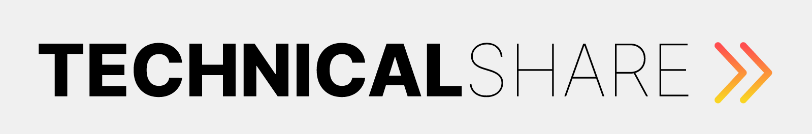

<div align="center">



</div>

## Menu

- [Sobre](#-sobre)
- [Documentação API](#blue_book)
- [Pré-requisitos](#exclamation)
- [Instalação](#floppy_disk)
  - [Teste](#rotating)
  - [Estrutura de pasta](#open_file_folder)
- [Licença](#memo)
- [Autor](#smiley_cat)

## 💻 Sobre

A TechnicalShare é uma plataforma criada para solucionar o problema de uma empresa cliente da área de tecnologia: a falta de registro de profissionais e suas habilidades. Através dela é possível buscar e cadastrar usuários especificando seus conhecimentos e habilidades, permitindo assim a troca de experiências e networking entre eles.

Este projeto foi desenvolvido pela Squad-33, uma das equipes participantes do Hackathon do Programa de Formação - Season 3, realizado pelo [grupo FCamara](https://www.fcamara.com.br/), e é dividido entre [technicalshare-front](https://github.com/squad33-hackaton/technicalshare-front) e [technicalshare-api](https://github.com/squad33-hackaton/technicalshare-api).

## 📚 Documentação API

Acesse a documentação em [Postman](https://documenter.getpostman.com/view/17833489/Uyr5myh9)

## 📝 Pré-requisitos

É necessário ter as ferramentas abaixo instaladas e configuradas no seu computador:
- **Apache HTTP Server** (recomendável versão 2.4 ou superior)
- **PHP** (recomendável 8.0 ou superior)
- **MySQL** (recomendável versão 8.0 ou superior)

## 💾 Instalação API (Windows)

* Baixar e instalar (usando configuração padrão) o [XAMPP](https://www.apachefriends.org/pt_br/download.html) e o [Git](https://git-scm.com/download/win):

* Após concluir a instalação, executar o `XAMPP` e iniciar os serviços `Apache` e `MySQL` (clicando nos botões `Start`)

* Criar a pasta `C:\xampp\www\`

* Abrir o Git e executar:

   ```
   git clone https://github.com/squad33-hackaton/technicalshare-api.git C:\\xampp\\www
   ```

* Abrir o endereço http://localhost/phpmyadmin/ no navegador

* Acessar a aba `SQL`, copiar o conteúdo do arquivo `C:\xampp\www\technicalshare-api\install\database\1.create-database.sql`, colar no campo de texto e clicar em `Continuar`

* Repetir o processo acima com os arquivos `2.create-user.sql` e `3.populate-database.sql`

* Abrir o arquivo `C:\Windows\System32\Drivers\etc\hosts` em um editor de texto (com permissão de administrador) e adicionar ao fim do arquivo:
   
   ```
   127.0.0.1 api.technicalshare api.localhost
   ```

* Abrir o arquivo `C:\xampp\apache\conf\extra\httpd-vhosts.conf` e adicionar ao fim do arquivo:
   ```
   <VirtualHost *:80>
      ServerName api.localhost
      ServerAlias api.technicalshare
      DocumentRoot "C:\xampp\www"
   </VirtualHost>
   ```

* Abrir o arquivo `C:\xampp\apache\conf\httpd.conf` e adicionar ao fim do arquivo:
   ```
      <Directory "C:/xampp/www">
         AllowOverride All
         Require all granted
      </Directory>
   ```

* Reiniciar serviço do Apache no XAMPP

## 💾 Instalação Front-end

* Acesse [TechnicalShare-Front](https://github.com/squad33-hackaton/technicalshare-front) para prosseguir com a instalação do front-end.

## ✔️ Teste

Acesse o endereço http://localhost/ no navegador, você receberá a mensagem `"TechnicalShare API"` caso tenha configurado corretamente.

Para realizar as requisições na API utilize um cliente HTTP, como o [Postman](https://www.postman.com/).

## 📂 Estrutura de pastas

```
.
├── App           # Código fonte do projeto
├── install       # Pasta contendo arquivos de instalação
├── public        # Pasta com acesso público
├── autoload.php
├── README.md
└── .htaccess
```

## 👨‍💻 Equipe

Integrantes da Squad-33 🍊:

- [Celso Tavares](https://www.linkedin.com/in/celsotavaresdev) (Dev)
- [Murillo Bazilio](https://www.linkedin.com/in/murillobazilio/) (Dev)
- [Andrew Rodrigo](https://www.linkedin.com/in/andrew-rodrigo-1080a1204/) (UX/UI)
- [Lucas Duarte](https://www.linkedin.com/in/lucasdelimaduarte/) (UX/UI)
- [Markellen Bonato](https://www.linkedin.com/in/markellen-bonato-8255ab218/) (UX/UI)